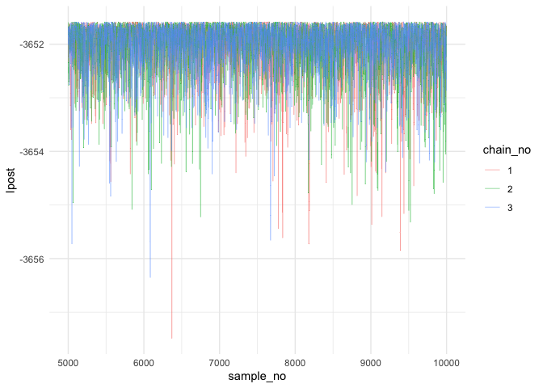

PTMC\_usage
================
David Hodgson

``` r
#devtools::install(ptmc) install if needed
library(ptmc)
library(tidyverse)
```

    ## ── Attaching packages ─────────────────────────────────────────────────────────────────────────────────────────────────────────────────────────────────────────────────────────────────────────────────────────────────────────────────────── tidyverse 1.3.0 ──

    ## ✓ ggplot2 3.2.1     ✓ purrr   0.3.3
    ## ✓ tibble  2.1.3     ✓ dplyr   0.8.3
    ## ✓ tidyr   1.0.0     ✓ stringr 1.4.0
    ## ✓ readr   1.3.1     ✓ forcats 0.4.0

    ## ── Conflicts ────────────────────────────────────────────────────────────────────────────────────────────────────────────────────────────────────────────────────────────────────────────────────────────────────────────────────────── tidyverse_conflicts() ──
    ## x dplyr::filter() masks stats::filter()
    ## x dplyr::lag()    masks stats::lag()

``` r
library(coda)
```

Parallel Tempering Monte Carlo
==============================

Model
-----

The example model is taken from Ben Lambert's fantastic book, "A Student's Guide to Bayesian Statistics," [Questions 13.3](https://benlambertdotcom.files.wordpress.com/2018/08/bayesianbook_problemsanswers_final.pdf#page=124). Breifly, I assume the random count variable *X*<sub>*t*</sub>, the number of mosquitos caught during day *t*, is Poission, such that

where *μ* is a constant mortality hazard rate and *ψ* is the daily recapture probability with priors distributions of *μ* ∼ *Γ*(2, 20) and *ψ* ∼ *Beta*(2, 40). The data *x*<sub>*t*</sub>, the number of mosquitos caught on day *t* is given in the RWM\_mosquito.csv file but can be obtained [here](https://benlambertdotcom.files.wordpress.com/2018/08/all_data.zip).

Implementation
--------------

### Create the model

The `model` variable should be a list with three functions, `gen_init`, `eval_lpr`, and `eval_ll` and a vector string with the parameter names used in the calibration, `par_names`.

#### vector string `parnames`

A vector string of the parameter names

#### func `gen_init`

A function which generates the original samples (usually the prior distributions)

-   (no arguments)
-   @return vector of values

#### func `eval_ll`

A function which generates the log likelihood for a set of parameter values

-   @param data, data needed to calcualte the log likelihood
-   @param params, parameter values
-   @return log likelihood

#### func `eval_lpr`

A fucntion which calcualte the log prior for a set of parameter values

-   @param params, parameter values
-   @return log prior

``` r
# model is a list of three functions
model <- list(

  par_names = c("mu","psi"),

  # Generate the initial step of Markov chain
  gen_init = function() {
    c(rgamma(1, 2, 20), rbeta(1, 2, 40))
  },

  # Evaluate the log prior
  eval_lpr = function(params) {
    if (params[1] < 0 || params[2] < 0 || params[1] > 1 || params[2] > 1)
      return(-Inf)

    lpr <- 0
    lpr <- lpr + log(pgamma( params[1], 2,20))
    lpr <- lpr + log(pbeta( params[2], 2,40))
    lpr
  },

  # Evaluate the log likelihood
  eval_ll = function(data, params) {
    y <- data$y
    mu <- params[1]
    psi <- params[2]
    ll <- 0;
    for (t in 1:length(data$y))
    {
      sum_x = 0
      lambda = 1000*exp(-mu*(t+1))*psi;
      for (i in 1:y[t]){
        sum_x <- sum_x + i
      }
      ll <- ll - lambda + y[t]*log(lambda) - sum_x
    }
    ll
  }
)
```

### Obtain the data

Data used in the likelhood function can be in any format.

``` r
dataMos <- read.csv("./RWM_mosquito.csv")
# restructure the data for the log likelihood function
data <-   list(
  time = dataMos$time,
  y = dataMos$recaptured
)
```

### Settings

The settings for the parallel tempering calibrations are summarised here

#### Settings Options

-   nrChains, number of independent chains to run
-   M, number of dependent chains per chain run (i.e. the number of rungs in the temperature ladder)
-   iterations, the number of steps to take in the Markov chain, (including the burn in)
-   burn, the number of steps int he burn in (these are discarded)
-   thin, thinning of the chain (i.e. =10 means only everything 10th sample is saved)
-   consoleUpdates, frequency in which the console updates (i. =100 means every 100th step)
-   P, number of parameters
-   adap\_Cov, whether to include adaptive covariance
-   adap\_Cov\_freq, frquency the adaptive covariance matrix os updated
-   adap\_Cov\_burn, number of steps to take before using the adaptive covariance matrix
-   adap\_Temp, wheter to include adaptive temperature ladder
-   adap\_Temp\_freq, frequency the adaptive temperature ladder is updated
-   Debug, run with debug output

``` r
# settings used for the ptmc model (See README)
settings <-  list(
  nrChains = 3,
  M = 10,
  iterations = 10000, 
  burn = 1,
  thin = 1,
  consoleUpdates = 100,
  P = 2,        
  adap_Cov = TRUE,
  adap_Cov_freq = 1,
  adap_Cov_burn = 1000,
  adap_Temp = TRUE,
  adap_Temp_freq = 1,
  Debug = FALSE
)
```

### Run the model.

``` r
post <- ptmc_func(model=model, data=data, settings=settings)
```

Plot the data
-------------

`ptmc_func` returns a list of length two. The first element is `post$mcmc` and is a mcmc or mcmc.list object (from the code package). I can plot these and calcualte convergence diagnostics using coda functions:

``` r
# Plot trace plots and posterior distributions for $mcmcriors for a chain i
par(mar = rep(2, 4)) # just for plotting purposes
summary(post$mcmc)
```

    ## 
    ## Iterations = 1:9999
    ## Thinning interval = 1 
    ## Number of chains = 3 
    ## Sample size per chain = 9999 
    ## 
    ## 1. Empirical mean and standard deviation for each variable,
    ##    plus standard error of the mean:
    ## 
    ##        Mean       SD  Naive SE Time-series SE
    ## mu  0.10047 0.008647 4.993e-05      9.532e-05
    ## psi 0.04661 0.003369 1.945e-05      3.569e-05
    ## 
    ## 2. Quantiles for each variable:
    ## 
    ##        2.5%     25%     50%     75%   97.5%
    ## mu  0.08366 0.09481 0.10041 0.10591 0.11762
    ## psi 0.04027 0.04436 0.04651 0.04873 0.05346

``` r
plot(post$mcmc)
```


``` r
# Plot the Gelman-Rubin diagnostic for the parameters
gelman.plot(post$mcmc)
```


``` r
gelman.diag(post$mcmc)
```

    ## Potential scale reduction factors:
    ## 
    ##     Point est. Upper C.I.
    ## mu           1       1.00
    ## psi          1       1.01
    ## 
    ## Multivariate psrf
    ## 
    ## 1

The second element is `post$lpost` and is long table dataframe of the log posterior values. These values can be easily plotted using ggplot2:

``` r
# Plot of the logposterior for the three chains
lpost_conv <- post$lpost %>% filter(sample_no>5000)
logpostplot <- ggplot(lpost_conv, aes(x = sample_no, y = lpost)) + 
  geom_line(aes(color = chain_no), size = 0.2, alpha=0.8) +
  theme_minimal()
logpostplot
```


